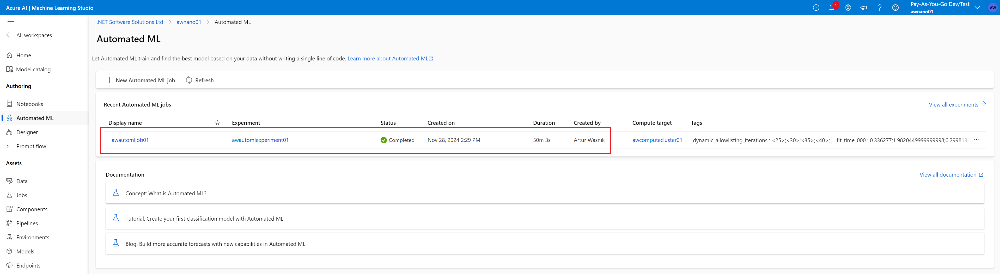

# AutoML with Azure Machine Learning Studio

This project demonstrated Azure Machine Learning Studio and its ability to prepare data to train a model, train the model with AutoML, create and publish a pipeline for the model, and access the model via API (JSON endpoint) to make predictions.
The goal was to train a binary classification model through AutoML to identify if a client will subscribe to a term deposit with the bank.

## Architectural Diagram

## Key Steps

**1. Authentication**
   I used my own environment for the project. In this step, I created a service principle with az. The service principle is then assigned  to the Azure Machine learning workspace with controlled permissions to access it.
   
   
   

**2. Registering dataset in Azure Machine Learning Studio**
   In this step I registered the Bankmarketing dataset in the Azure Machine Learning Studio
   

**3. Create a new experiment and run it**
    In this step I created a new experiment in Azure ML Studio with the uploaded Bankmarketing dataset and run the job on the compute cluster.
    
    From the completed experiment I was able to find the best model.
    

**4. Deploy the best model**
    In this step I deployed the best model using Azure Container Instances. Deployment created a JSON endpoint which could be used for a prediction.
    I also enabled Application Insights to be able to collect logs
    
    I used the logs.py to get the logs
    
    I also ran the endpoint.py file to check if the endpoint is accessible.
    

**5. Test deployment locally with Swagger**
    In this step I downloaded the swagger.json file from the endpoint config. I ran Swagger locally and test the endpoint
      
      

**6. Consume the endpoint**
    In this step I firstly ran the benchmark tool Apache Benchmark to test that the deployed model is consistently performing at the level we are expecting.
    
    Lastly I sent a request to the prediction endpoint with test data
    

**7. Create, Publish, and Consume a Pipeline via Jupiter Notebook**
    While of the above steps can be completed manually, they can also be done programmatically using Python SDK and AzureML SDK as in the [Jupiter Notebook](./aml-pipelines-with-automated-machine-learning-step.ipynb).
    I have configured the notebook accordingly to my environment and executed it. The details of the execution can be found in the screenshots below as well as in the notebook itself.
    
    
    
    

## Screen Recording

Link to the recording: 

## Future Enhancements

I think the most useful enhancement, from the development perspective, would be to allow Swagger UI to make requests directly to the endpoint. That would allow faster testing of the deployed model.
Also it would be interesting to play more with setting up pipelines for different models e.g. regression.
